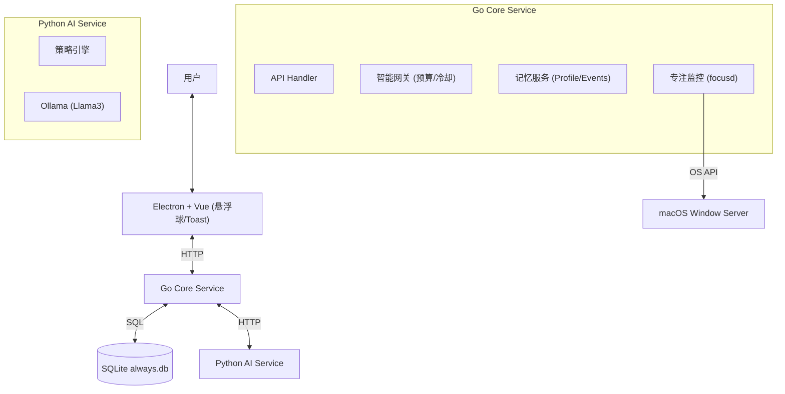

# Always (Local Silent Companion Agent)
## 本项目正在开发中...
Always 是一个本地优先（Local-first）的桌面陪伴 Agent，旨在通过非侵入式的方式帮助用户保持专注与健康。它具备长期记忆能力，能够根据用户的行为习惯和偏好，智能地决定何时介入、如何建议。

## 核心特性

*   **静默陪伴**: 默认不打扰，仅在关键时刻（如长时间久坐、频繁分心、深夜加班）给出轻量建议。
*   **长期记忆**: 基于 SQLite 的本地记忆系统，能记住你的工作习惯、偏好（Profile）以及近期关键事件（Memory Events）。
*   **智能网关**: 内置“介入预算”与“冷却机制”，防止 AI 过度打扰。
*   **反馈闭环**: 支持对建议进行 👍/👎 反馈，系统会自动调整后续策略并更新用户画像。
*   **隐私安全**: 所有数据（屏幕活动、记忆、日志）均存储在本地，推理使用本地 Ollama 模型。

## 架构概览



## 快速开始

### 前置依赖
*   **Node.js** (v18+)
*   **Go** (v1.21+)
*   **Python** (v3.11+, 推荐使用 conda 环境)
*   **Ollama** (必需，如 `ollama pull llama3.1:8b`)

### 启动服务

1.  **创建 Python 环境**（首次使用）
    ```bash
    conda create -n always python=3.11 -y
    conda activate always
    cd services/ai-py && pip install -r requirements.txt
    ```

2.  **启动所有服务 (开发模式)**
    ```bash
    # 推荐使用脚本一键启动
    ./scripts/dev.sh
    ```
    开发日志输出到 `logs/dev/`（ai.log、core.log、desktop.log），方便排查错误。
    或者分别启动：
    *   **Core**: `cd services/core-go && go run main.go` (Port: 52123)
    *   **AI**: `conda activate always && cd services/ai-py && python -m uvicorn main:app --host 127.0.0.1 --port 8788`
    *   **UI**: `cd apps/desktop && npm run dev`
    
    **注意**: 默认使用 Ollama 策略；若设置为其他值，将提示无可用环境。

3.  **使用说明**
    *   启动后，桌面右上角会出现一个悬浮球。
    *   **悬浮球颜色**: 灰色(静默) / 蓝色(轻度) / 橙色(积极)。
    *   **左键单击**: 自动请求 AI 建议并显示 Toast 弹窗。
    *   **双击**: 展开完整面板，可手动输入内容与 AI 对话。
    *   **右键**: 打开系统菜单（设置/退出）。
    *   **拖动**: 移动悬浮球位置。
    *   **AI 建议**: Toast 弹窗显示建议内容，支持 👍/👎 反馈。

## 关键模块说明

### 1. 核心服务 (Go)
*   **Gateway**: 实现了 Stateful 的拦截逻辑。
    *   *冷却时间*: 默认 5 分钟内不重复打扰。
    *   *预算控制*: 每次介入消耗预算（如 `TASK_BREAKDOWN` 消耗 3 点），预算随时间恢复。
*   **Memory**: 管理 `profiles` (用户画像) 和 `memory_events` (事件流)。
    *   自动根据用户反馈 (Feedback) 更新画像。
    *   在每次决策时注入最近 5 条关键记忆。

### 2. AI 服务 (Python)
*   基于 FastAPI，当前策略：
    *   **ollama**: 调用本地 Ollama LLM，动态注入 `User Profile` 和 `Recent Memories`，具备上下文感知能力。
*   **结构化输出**: 输出 JSON 格式，包含 `action_type`, `message`, `confidence`, `cost`, `risk_level` 等字段。
*   **五种建议类型**: DO_NOT_DISTURB, ENCOURAGE, TASK_BREAKDOWN, REST_REMINDER, REFRAME。

### 3. 桌面端 (Electron + Vue)
*   **FloatingBall**: 常驻桌面的轻量级入口，支持拖拽。
*   **SuggestionToast**: 低打扰的建议展示组件。
*   **FocusMonitor**: 实时采集前台应用与窗口标题（仅本地使用）。

## API 示例

### POST /v1/decision
请求 AI 进行决策：
```json
{
  "context": {
    "user_text": "我有点累了",
    "mode": "ACTIVE",
    "timestamp": 1710000000000,
    "signals": {
      "focus_app": "VS Code",
      "focus_minutes": "45"
    }
  }
}
```

响应 (包含记忆注入与网关决策)：
```json
{
  "action": {
    "action_type": "REST_REMINDER",
    "message": "你已经连续工作45分钟了，根据你的习惯，建议休息一下。",
    "confidence": 0.85
  },
  "gateway_decision": {
    "decision": "ALLOW",
    "reason": "allow"
  },
  "context": {
    "profile_summary": "- work_style: 喜欢番茄工作法",
    "memory_summary": "- User provided feedback LIKE for action REST_REMINDER"
  }
}
```

## 开发指南

*   **数据库**: SQLite 文件位于 `services/core-go/data/always.db`。
*   **日志**: AI 服务日志位于 `services/ai-py/logs/` 或 `/tmp/always-ai.log`。
*   **配置**: 通过 UI 设置面板（右键悬浮球 → 设置）调整介入频率与安静时段。
    *   支持选择 Ollama 模型（从本地 Ollama 自动读取，需与 `ollama list` 一致），保存后生效。

### 环境变量
*   `CORE_PORT`: Go 服务端口（默认 52123）
*   `AI_URL`: AI 服务地址（默认 http://127.0.0.1:8788）
*   `LUMA_POLICY`: AI 策略选择，可选 `ollama`（默认 ollama）
*   `OLLAMA_MODEL`: Ollama 模型名称（默认 llama3.1:8b）
*   `OLLAMA_URL`: Ollama API 地址（默认 http://localhost:11434/api/generate）
*   **超时**: Core 调 AI 默认超时 60s；AI 调 Ollama 默认超时 60s（模型首次加载可能较慢）。

## License
MIT
